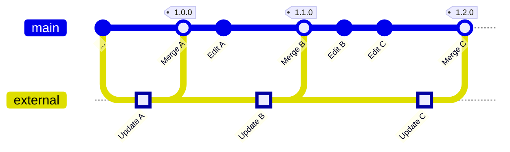

# Documentation Data

This folder is meant as a repository for function, category, and table definitions both official and unofficial. Official information ([Like the scripting API](https://teardowngame.com/modding/api.html)) is retrieved from the relevant pages when updated and may be modified in this repo on the appropriate branch (see below).

The end goal is for it to exist as a structured pool of information for community members who wish to contribute knowledge and projects that aim to render this knowledge in some fashion (wiki pages, IDE extensions, ...).

## Structure

The `index.json` file contains the definition for what other folders in this directory represent. The `_tools` folder is an exception; it contains the tools for automatically gathering the information from external sources (official or otherwise).

## Updating External Information

In order to keep up with the external modding resources, this repository contains the tools and procedures to retrieve their information. Resolving conflicts arising from divergences between community modifications and external edits should be handled in the typical git-fashion:

Automated retrieving tools should have their changes commited to the `external` branch. **Do not commit manual edits to this branch!** When the `external` branch gets updated, it should be merged into the `main` branch either locally by a maintainer or by creating a Pull Request. The following graph depicts this process over multiple updates:

Conflict resolution should be considered carefully, we don't want to ignore official updates, but community-contributed knowledge should certainly not be deleted if it is still relevant.
